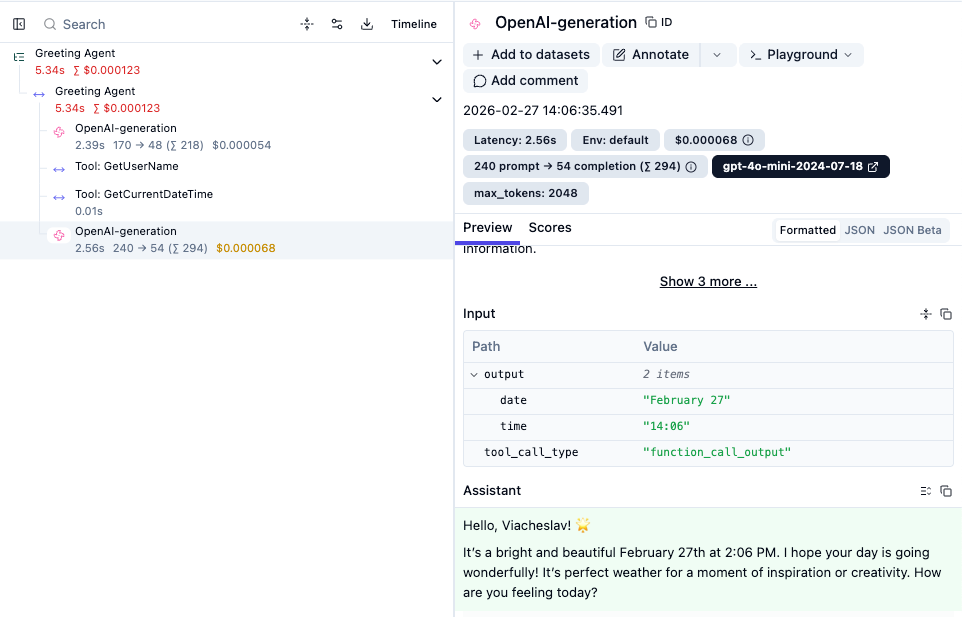

[](https://plugins.gradle.org/plugin/org.jetbrains.ai.tracy)
[](https://github.com/openai/openai-java)
[](https://kotlinlang.org)
[](https://jetbrains.github.io/tracy/0.1.0)
[](https://jetbrains.github.io/tracy/0.1.0/api)

# Tracy Example

> OpenAI tool-calling agent with full observability via Tracy + Langfuse

---

## Quickstart

```bash
git clone https://github.com/JetBrains/tracy-example.git
cd tracy-example

export OPENAI_API_KEY=sk-...
export LANGFUSE_PUBLIC_KEY=pk-lf-...
export LANGFUSE_SECRET_KEY=sk-lf-...

./gradlew run
```

Get your Langfuse keys at **[langfuse.com](https://cloud.langfuse.com/) → Project Settings → API Keys**.

---

## What it does

Asks GPT-4o-mini to greet you. The model calls two tools to get your name and the current time, then writes the greeting. Every step shows up as a span in Langfuse.



> **Want to see the app without any instrumentation?**
> Check out the `without-tracy` branch, the same app with Tracy and Langfuse completely removed.
>
> **Want to see what instrumenting this app looks like with the raw OpenTelemetry SDK instead of Tracy?**
> Check out the `otel-sdk-trace` branch — same agent, manually instrumented, with a breakdown of the tradeoffs.

---

## Instrumentation

The Tracy Gradle plugin instruments `@Trace`-annotated methods at compile time, so no manual span code.

**SDK init** ([`Setup.kt`](src/main/kotlin/tracy/example/app/Setup.kt)):

```kotlin
val sdk = configureOpenTelemetrySdk(
    exporterConfig = LangfuseExporterConfig(langfusePublicKey = ..., langfuseSecretKey = ...)
)
TracingManager.setSdk(sdk)
TracingManager.isTracingEnabled = true
TracingManager.traceSensitiveContent() // records raw prompts and completions
```

**OpenAI client** ([`Setup.kt`](src/main/kotlin/tracy/example/app/Setup.kt)):

```kotlin
val client = OpenAIOkHttpClient.fromEnv().also { instrument(it) }
```

**Tools** ([`Tool.kt`](src/main/kotlin/tracy/example/app/Tool.kt)):

```kotlin
interface Tool<T> {
    @Trace("Tool Execution", metadataCustomizer = ToolMetadataCustomizer::class)
    fun execute(): T
}
```

`ToolMetadataCustomizer` names each span after the class (`"Tool: GetUserName"`).

**Root span** ([`GreetingAgent.kt`](src/main/kotlin/tracy/example/app/GreetingAgent.kt)):

```kotlin
withSpan("Greeting Agent") { ... }
```

---

## Structure

| File                                                                               |                           |
|------------------------------------------------------------------------------------|---------------------------|
| [`App.kt`](src/main/kotlin/tracy/example/app/App.kt)                               | `main()`                  |
| [`Setup.kt`](src/main/kotlin/tracy/example/app/Setup.kt)                           | Tracy init, OpenAI client |
| [`Tool.kt`](src/main/kotlin/tracy/example/app/Tool.kt)                             | `Tool<T>` interface       |
| [`GetUserName.kt`](src/main/kotlin/tracy/example/app/GetUserName.kt)               | tool: OS username         |
| [`GetCurrentDateTime.kt`](src/main/kotlin/tracy/example/app/GetCurrentDateTime.kt) | tool: date & time         |
| [`GreetingAgent.kt`](src/main/kotlin/tracy/example/app/GreetingAgent.kt)           | agent loop                |

---

## Learn More

- **[Tracy Documentation](https://jetbrains.github.io/tracy/0.1.0)** — Full guide on tracing APIs, OpenTelemetry configuration, and compiler plugin
- **[API Reference](https://jetbrains.github.io/tracy/0.1.0/api)** — Detailed API docs for all Tracy modules
